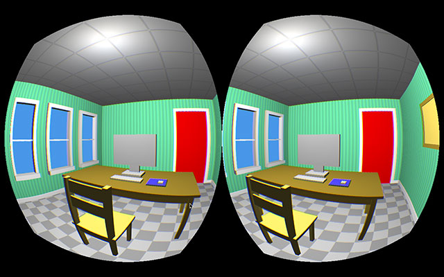
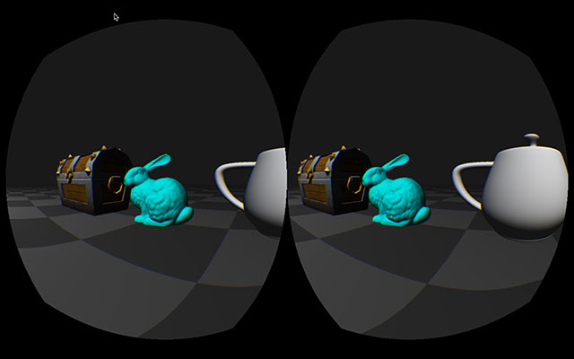

# Oculus SDL2 Examples

This is a set of minimal cross-platform example applications for the Oculus Rift written in C++ and depending only on SDL2, the Oculus VR SDK version 0.4, and GLEW.

These examples share a simple SDL2 application framework that provides an OpenGL 3.2 Core Profile and an FPS-style interaction. Their modular design enables easy reuse and the license permits you to copy them for any purpose.

The Oculus SDK continues to evolve as of this writing (Oct 2014). The documentation lags behind the implementation. `OVR_SDL2_app` is a by-the-book implementation of an Oculus app, as described by the Developer's Guide, but a great deal of digging through the headers was necessary to complete the job. That's all encoded here.

This code also makes good use of SDL2, particularly the new game controller API, which presents all inputs as though they came from an XBox controller. The SDL2 event loop also delivers controller connection and disconnection events, which this code uses supports completely.

## Usage

`ESC` exits.

Keyboard-mouse navigation uses `WASD` to move and the mouse to turn. `Space` moves up and `C` moves down.

Gamepad navigation moves with the left stick and turns with the right. Button A moves up and button B moves down.

`OVR_SDL2_obj` takes a list of OBJ input files on the command line.

## Structure

- `OVR_SDL2_app` implements a cross-platform VR application base class using SDL2 and the Oculus SDK.

	- `OVR_SDL2_nav` subclasses `OVR_SDL2_app` to implement first-person-style navigation supporting both gamepad and keyboard-mouse inputs.

		- `OVR_SDL2_room` subclasses `OVR_SDL2_nav` to implement a tiny room demo.

		- `OVR_SDL2_obj` subclasses `OVR_SDL2_nav` to implement a Wavefront OBJ viewer application.

- `GLFundamentals` implements the necessary OpenGL functionality including matrix mathematics and shader handling.

- `GLFramebuffer` encapsulates an OpenGL framebuffer object.

## Screenshots

- `OVR_SDL2_room`

	

- `OVR_SDL2_obj`

	

## Building

### Windows

A Visual Studio 2013 solution is provided. It contains projects for `OVR_SDL2_room` and `OVR_SDL2_obj`. Check the "VC++ Directories" settings in each project to ensure that SDL2, the Oculus SDK, and GLEW can be located.

If building a project from scratch, link `SDL2.lib`; `SDL2main.lib`; `libovr.lib`; `glew32.lib`; `opengl32.lib`; `ws2_32.lib`; `winmm.lib`

### OS X

The OS X build does *not* require GLEW.

Install the [SDL2](http://libsdl.org/download-2.0.php) framework to `/Library/Frameworks` and follow the Linux directions...

### Linux

Check the `Makefile` to ensure that the following definition gives the correct location for the Oculus SDK.

		OVR= /usr/local/OculusSDK/LibOVR

Build using `make`

		$ make

